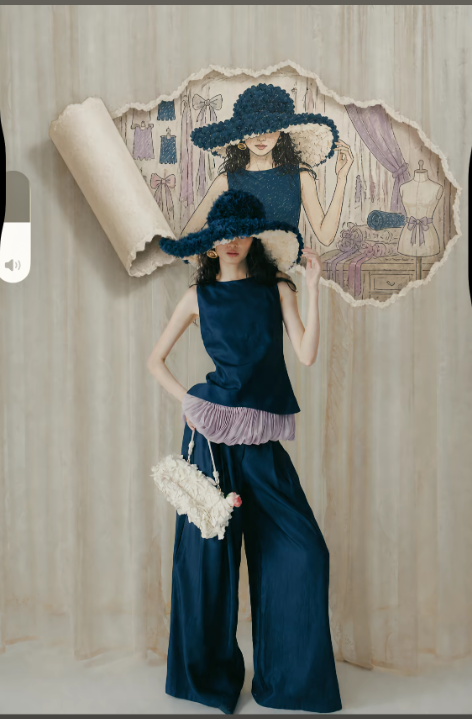
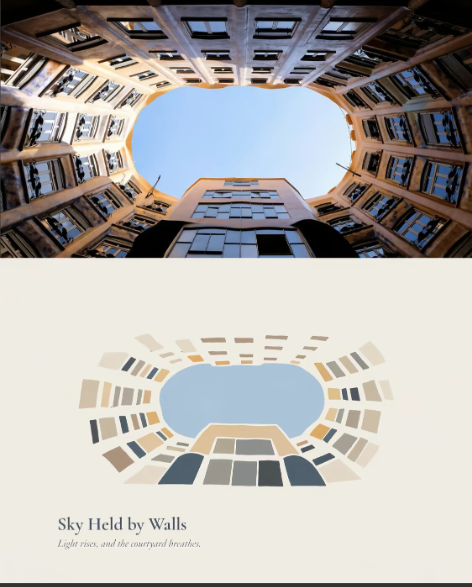
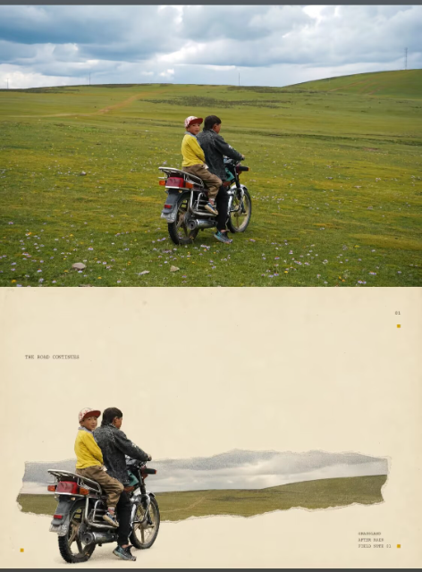
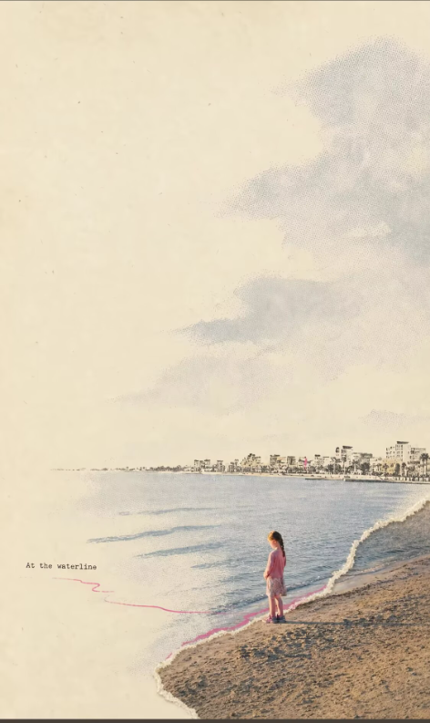
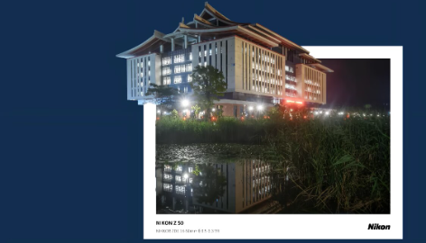

# jovi-photo · AI 摄影艺术转化 Skill 统一套件库

[](https://opensource.org/licenses/MIT)
[](https://github.com/Jovifei/jovi-photo)

**`jovi-photo`** 是一套专门面向 AI 编码助手（Google Antigravity、Claude Agentic IDE）与图像生成引擎打造的**摄影艺术转化 Skill 套件**。

仓库根目录**直接托管 5 个独立重构与创新的 `jv-` 前缀核心 Skill 文件夹**与**裁剪裁切后的干净艺术转换对比图库**，打开即用，直观清爽！

---

## 📌 仓库目录结构 (Repository Structure)

```text
jovi-photo/
├── assets/
│   └── examples/                       # 干净裁切的艺术效果对比图库（无手机边框）
│       ├── torn-world-portal.png
│       ├── scene-essence-minimal.png
│       ├── photo-specimen-journal.png
│       ├── chromatic-gesture-zine.png
│       └── frame-escape-print.png
├── jv-chromatic-gesture-zine-v1-0/      # 1. 高彩轨迹拼贴纸刊
├── jv-frame-escape-print-v1-0/          # 2. 冲印破框
├── jv-photo-specimen-journal-v1-0/      # 3. 摄影标本日志
├── jv-scene-essence-minimal-v1-0/       # 4. 场景极简精粹
├── jv-torn-world-portal-v1-0/           # 5. 现实撕裂传送门
└── README.md                               # 统一套件说明与使用指南
```

---

## 🎨 `jv-` 5 大 Skill 详细原理、前后转换对比与最佳 Prompt

---

### 1. `jv-torn-world-portal-v1-0` · 现实撕裂传送门

#### 🖼️ 效果对比示例


#### 📖 前后转换原理与细节拆解
- **原照片特征**：真实雪山、公路、建筑或运动中的物体（如雪地、车轮、路标）。
- **转换后效果**：顺着原图的结构线条（路标斜线、车轮弧线、雪山脊线）**物理性撕开照片**，撕口边缘露出真实纸张手撕毛边，而撕开的内部显现出**手绘水彩风格的平行奇幻世界**（如雪山下的奇幻雪怪、摩天轮上的卡通天空、设备的内部机械透视）。
- **三种叙事模式**：
  1. *暗藏世界揭示*（撕开显现水下雪怪、剖面空间）
  2. *奇幻世界延伸*（撕开延伸出卡通天空、透视路标）
  3. *微观内构剖析*（撕开展示建筑/设备内部透视图）

#### 📷 最佳推荐适用照片
具有明确**切割/引导线条**的照片：车轮弧线、路标斜线、建筑剖面、海岸线、水面与陆地交界线。

#### 💬 最佳 Agent 对话 Prompt
> *"使用 $jv-torn-world-portal-v1-0，分析这张照片的撕口位置，顺着路标/车轮的线条撕开照片，露出背后奇幻的手绘水彩平行世界。"*

---

### 2. `jv-scene-essence-minimal-v1-0` · 场景极简精粹

#### 🖼️ 效果对比示例


#### 📖 前后转换原理与细节拆解
- **原照片特征**：繁复的城市建筑仰视、同心圆天井、天际线、寺庙塔楼或工业管道建筑。
- **转换后效果**：呈现为**上下双联**（横图）或 **左右并排**（竖图）。上半部/左半部为原图，下半部/右半部在暖米色纸面上保留原图的**透视消点与径向排列骨架**，将繁复建筑简化为最少的扁平几何色块，并指定**唯一一个强色彩锚点**（如朱红斜坡、金色塔尖），配以优雅的诗意主副标题。
- **五种渲染手法**：几何色块(A) + 结构线条(B) + 水彩淡洗(C) + 有机团簇(D) + 径向透视几何排列(E)。

#### 📷 最佳推荐适用照片
城市天际线、高迪式同心圆天井仰视、寺庙塔楼、斜向透视鸟瞰街景、蓬皮杜类钢架工业建筑。

#### 💬 最佳 Agent 对话 Prompt
> *"使用 $jv-scene-essence-minimal-v1-0，采用左右并排/上下双联版式，保留原图的径向透视骨架，提取一个朱红/金色色彩锚点，生成场景极简海报。"*

---

### 3. `jv-photo-specimen-journal-v1-0` · 摄影标本日志

#### 🖼️ 效果对比示例


#### 📖 前后转换原理与细节拆解
- **原照片特征**：草原骑行、草地独坐、河畔靠坐、雪山风口等旅行或地质考察照片。
- **转换后效果**：**完全拒绝手绘插画**！下半部直接使用原图的**真实照片撕纸碎片与轮廓剪影**（如将骑摩托车的小孩精确沿轮廓扣出悬浮于草地撕条上）。周围留白区域配备**田野考察手记标注**：带有方位节点的虚线轨迹 (`N ····· S`)、**垂直测量刻度标尺线 (`01`, `07`, `5`)**、黄色档案标贴 (`■ 01`)、微型坐标与双语随笔序号 (`阳光不漫长 — 01/04`)。
- **四种碎片拆解模式**：全景横向撕条 / 轮廓剪影+背景条带 / 主体剪切+细节圆片 / 有机地貌切片。

#### 📷 最佳推荐适用照片
旅行风光、草原骑行/独坐人像、河畔靠坐、公路与自然考察照片。

#### 💬 最佳 Agent 对话 Prompt
> *"使用 $jv-photo-specimen-journal-v1-0，将这张照片中的人物切出轮廓剪影，配上测量刻度尺和方位虚线轨迹，制作一张旅行标本日志页。"*

---

### 4. `jv-chromatic-gesture-zine-v1-0` · 高彩轨迹拼贴纸刊

#### 🖼️ 效果对比示例


#### 📖 前后转换原理与细节拆解
- **原照片特征**：海岸水线、海滩救生塔、快艇喷水尾迹、悬崖水湾、荷塘水波等。
- **转换后效果**：真实照片嵌入大面积暖米色纸面（70%+ 留白），周围环境被简化为**半调网点 (Halftone Dots)**、**版画色块 (Woodblock)** 或干刷笔触。最核心的特征是：**一条高饱和度/荧光感的高彩线条（洋红/宝蓝/朱红/亮粉）物理性横跨手撕照片边缘**，将照片实景、纸面插画与打字机微字完美连接。

#### 📷 最佳推荐适用照片
海岸水线、沙滩救生塔、快艇/货轮水面、池塘荷影等具有强运动轨迹、水线延伸或视觉动态的照片。

#### 💬 最佳 Agent 对话 Prompt
> *"使用 $jv-chromatic-gesture-zine-v1-0，撕开照片边缘，用一条鲜艳的洋红/宝蓝高彩线条横跨撕纸边界，背景采用复古半调网点简化。"*

---

### 5. `jv-frame-escape-print-v1-0` · 冲印破框

#### 🖼️ 效果对比示例


#### 📖 前后转换原理与细节拆解
- **原照片特征**：中式古建筑飞檐屋脊、石拱桥、盛开花树、雪山尖顶等具有强方向延伸感元素的照片。
- **转换后效果**：照片被装载在一个**干净裁切的白色厚边冲印相框**内（框底部带有 `NIKON Z 50` / `FUJIFILM X-E1` 等相机品牌型号标注）。相框偏离中心放置于从原图提取的**单一纯色平涂背景**上（如深海军蓝、天蓝色、沙色），照片中最具延伸方向感的元素（如飞檐角、拱桥弧线、花枝）**无缝破框而出**，延伸进纯色背景中。框内框外照片均保持真实的相机冲印摄影质感。

#### 📷 最佳推荐适用照片
中式飞檐屋脊、石拱桥、盛开花枝、雄伟山峰尖顶等具有强方向延伸感的冲印质感照片。

#### 💬 最佳 Agent 对话 Prompt
> *"使用 $jv-frame-escape-print-v1-0，识别这张照片中最具延伸感的飞檐/拱桥/花枝，让其破框而出延伸进纯色背景，框底部配上相机品牌型号。"*

---

## 🛠️ 安装与 AI Agent 配置指南 (Installation & Setup)

### 克隆仓库到 Agent 的 Skills 目录

切换到您的 Agent 项目 Skills 目录（例如 `.claude/skills` 或 `.agents/skills`）并克隆仓库：

```bash
# 切换到 Agent 的 skills 目录
cd .claude/skills

# 直接克隆 jovi-photo 仓库
git clone https://github.com/Jovifei/jovi-photo.git
```

仓库根目录下的 5 个 `jv-` 文件夹将被 Agent 自动识别并激活使用！

---

## 🔗 借鉴与学习的 4 个基准 Skill (参考来源)

在开发 **`jv-`** 系列 Skill 时，我们深度学习并借鉴了开源社区中以下 4 个优秀 Skill 的色彩逻辑、留白率与排版架构（借鉴的代码不保存在本仓库，尊重原作者开源成果）：

1. **`gc-minimal-zine-poster-v0-1`** (日韩极简 Zine 海报)
   - *借鉴点*：四段式 Standard Prompt 编译器架构、大面积米白纸面留白 (70%+ 空置率)、高饱和度色彩锚点约束。
2. **`photo-abstract-editorial`** (摄影与抽象双联画报)
   - *借鉴点*：上下/左右双联画报版式、真实摄影与抽象几何色块对齐解构。
3. **`scene-distillation-zine-v1-3`** (场景纯插画提炼)
   - *借鉴点*：将繁复树叶、建筑纹理、人群压缩为少数安静大面积形体的提炼法则。
4. **`scenes-gathered-zine-v1-3`** (拾景纸刊·手撕拼贴)
   - *借鉴点*：真实照片手撕纸边缘（手撕白色纤维拉丝）与手记排版系统。

---

## 📜 开源协议 (License)

[MIT License](LICENSE) © 2026 [Jovifei](https://github.com/Jovifei)
